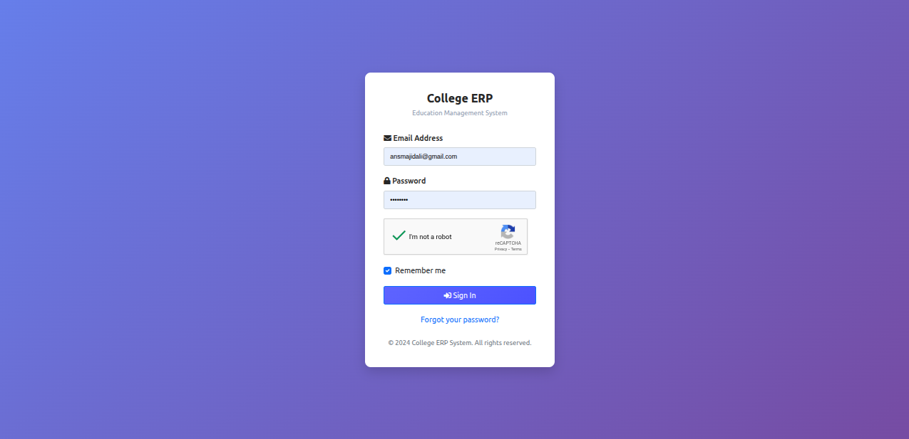
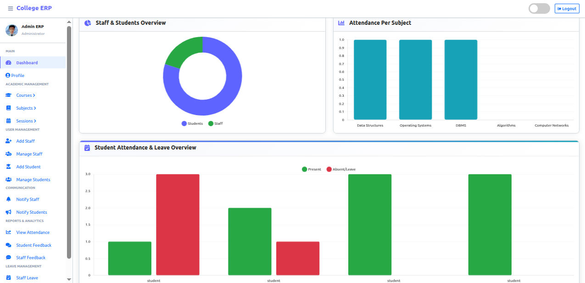
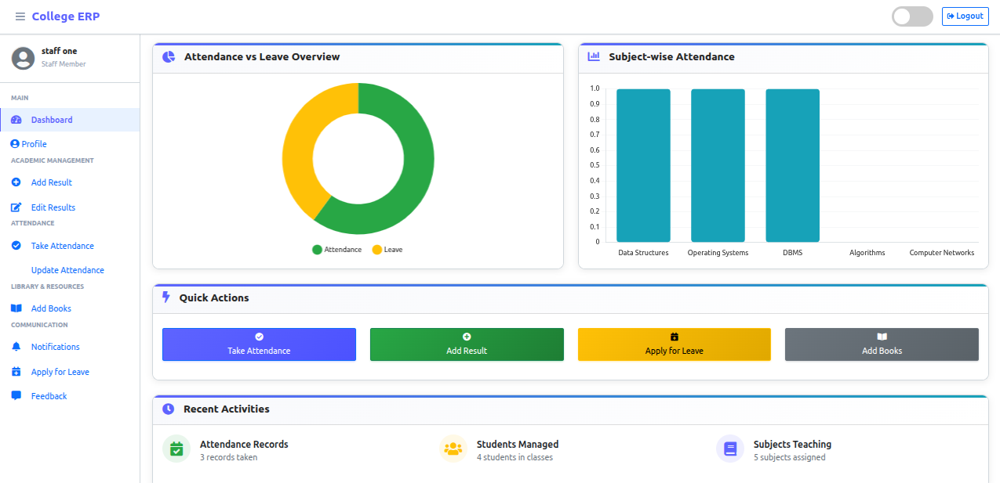
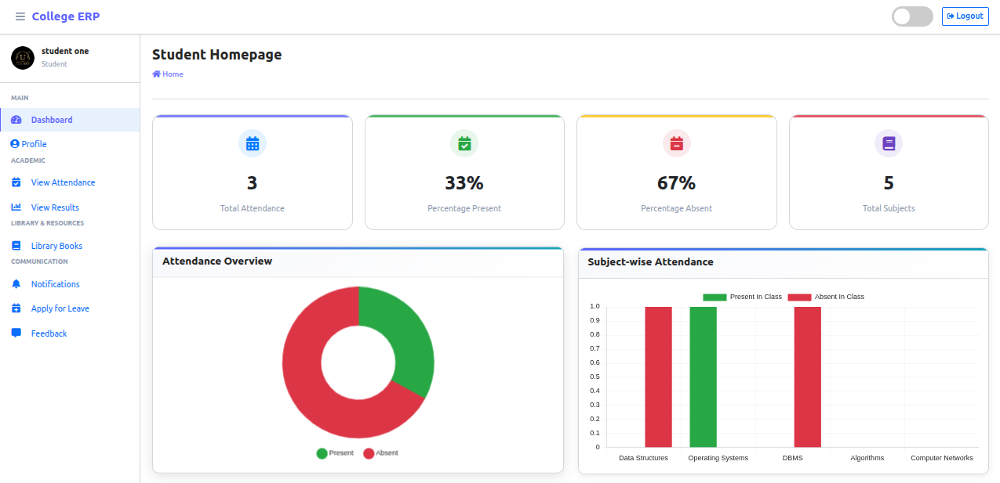

<div align="center">

# 🎓 College ERP System

### Enterprise Resource Planning Solution for Educational Institutions

[](https://github.com/Ansarimajid/College-ERP)
[](https://www.python.org/)
[](https://www.djangoproject.com/)
[](LICENSE)

[Live Demo](https://syncx.pythonanywhere.com) • [Report Bug](https://github.com/Ansarimajid/College-ERP/issues) • [Request Feature](https://github.com/Ansarimajid/College-ERP/issues)

</div>

---

## 📋 Table of Contents

- [About](#-about)
- [Features](#-features)
- [Demo Credentials](#-demo-credentials)
- [Technology Stack](#-technology-stack)
- [Installation](#-installation)
- [Screenshots](#-screenshots)
- [Roadmap](#-roadmap)
- [Contributing](#-contributing)
- [Support](#-support)

---

## 🎯 About

**College ERP** is a comprehensive Enterprise Resource Planning system designed specifically for educational institutions. Built with Python and Django, this full-stack web application streamlines administrative tasks, student management, and staff operations in one unified platform.

### ✨ Why Choose This ERP?

- 🚀 **Modern Tech Stack** - Built with Django for robust performance
- 📊 **Data-Driven Insights** - Visual dashboards for performance tracking
- 👥 **Multi-Role Support** - Separate interfaces for Admin, Staff, and Students
- 🔒 **Secure** - Role-based access control and authentication
- 📱 **Responsive Design** - Works seamlessly on all devices

---

## 🚀 Features

### 👨‍💼 Admin Dashboard

<details>
<summary>Click to expand Admin features</summary>

- 📈 **Analytics Dashboard** - Overview charts for student/staff performance, courses, and subjects
- 👥 **Staff Management** - Complete CRUD operations for staff members
- 🎓 **Student Management** - Add, update, and delete student records
- 📚 **Course Management** - Organize and manage academic courses
- 📖 **Subject Management** - Handle subject assignments and details
- 📅 **Session Management** - Control academic sessions and terms
- ✅ **Attendance Monitoring** - View and track student attendance
- 💬 **Feedback System** - Review and respond to feedback from students/staff
- 🏖️ **Leave Management** - Approve or reject leave applications

</details>

### 👨‍🏫 Staff Portal

<details>
<summary>Click to expand Staff features</summary>

- 📊 **Performance Dashboard** - Track student progress and subject analytics
- ✏️ **Attendance Management** - Mark and update student attendance
- 📝 **Result Entry** - Add and modify student examination results
- 🏖️ **Leave Applications** - Apply for personal leave
- 💭 **Feedback Channel** - Send feedback to administration

</details>

### 🎓 Student Portal

<details>
<summary>Click to expand Student features</summary>

- 📊 **Personal Dashboard** - View attendance, results, and leave status
- 📅 **Attendance Tracking** - Monitor class attendance records
- 🎯 **Result Portal** - Access examination results and grades
- 🏖️ **Leave Requests** - Submit leave applications
- 💬 **Feedback System** - Provide feedback to HOD

</details>

---

## 🔑 Demo Credentials

### 🌐 Live Demo
Visit: **[https://syncx.pythonanywhere.com](https://syncx.pythonanywhere.com)** (v2.0.0)

### Login Details

| Role | Email | Password |
|------|-------|----------|
| 👨‍🎓 **Student** | `studentone@student.com` | `studentone` |
| 👨‍🏫 **Staff** | `staffone@staff.com` | `staffone` |

---

## 🛠️ Technology Stack

| Category | Technologies |
|----------|-------------|
| **Backend** | Python, Django Framework |
| **Frontend** | HTML5, CSS3, JavaScript, Bootstrap |
| **Database** | SQLite (Development), PostgreSQL (Production Ready) |
| **Authentication** | Django Auth, Google reCAPTCHA |
| **Deployment** | PythonAnywhere |

---

## 📥 Installation

### Prerequisites

Ensure you have the following installed:

- ✅ [Git](https://git-scm.com/) - Version control
- ✅ [Python 3.x](https://www.python.org/downloads/) - Programming language
- ✅ [pip](https://pip.pypa.io/en/stable/installing/) - Package manager

### Step-by-Step Setup

#### 1️⃣ Clone the Repository

```bash
git clone https://github.com/Ansarimajid/College-ERP.git
cd College-ERP
```

#### 2️⃣ Create Virtual Environment

**Option A: Using Conda (Recommended)**
```bash
conda env create -f college-erp.yml
conda activate Django-env
```

**Option B: Using venv**

<details>
<summary>Windows</summary>

```bash
python -m venv venv
source venv/scripts/activate
```
</details>

<details>
<summary>macOS</summary>

```bash
python3 -m venv venv
source venv/bin/activate
```
</details>

<details>
<summary>Linux</summary>

```bash
virtualenv .
source bin/activate
```
</details>

#### 3️⃣ Install Dependencies

```bash
pip install -r requirements.txt
```

#### 4️⃣ Configure Settings

Open `settings.py` and update:

```python
ALLOWED_HOSTS = ['localhost', '127.0.0.1']
```

> ⚠️ **Security Note:** Never use `ALLOWED_HOSTS = ['*']` in production!

#### 5️⃣ Database Setup

```bash
python manage.py migrate
python manage.py createsuperuser
```

Follow the prompts to create an admin account.

#### 6️⃣ Run Development Server

```bash
# Windows
python manage.py runserver

# macOS/Linux
python3 manage.py runserver
```

🎉 **Success!** Visit `http://127.0.0.1:8000` in your browser

---

## 📸 Screenshots







---

## 🗺️ Roadmap

### ✅ Completed Features

- [x] Multi-role authentication system
- [x] Complete CRUD operations for all entities
- [x] Attendance management system
- [x] Result management with CBVs
- [x] Leave application workflow
- [x] Feedback system
- [x] Email notifications
- [x] Google reCAPTCHA integration
- [x] Profile management for all roles
- [x] Dynamic dashboard analytics
- [x] Responsive design
- [x] Password reset functionality

### 🔜 Upcoming Features


- [ ] SMS notifications
- [ ] Advanced reporting and analytics
- [ ] Online examination module
- [ ] Library management system
- [ ] Fee management integration
- [ ] Timetable generator
- [ ] Parent portal

---

## 🤝 Contributing

Contributions make the open-source community an amazing place to learn and create. Any contributions you make are **greatly appreciated**!

1. Fork the Project
2. Create your Feature Branch (`git checkout -b feature/AmazingFeature`)
3. Commit your Changes (`git commit -m 'Add some AmazingFeature'`)
4. Push to the Branch (`git push origin feature/AmazingFeature`)
5. Open a Pull Request

---

## 💖 Support the Project

If you find this project helpful, please consider:

- ⭐ **Star this repository** on GitHub
- 🐛 **Report bugs** to help improve the project
- 💡 **Suggest new features** via issues
- 📢 **Share** with fellow developers
- 👨‍💻 **Contribute** to the codebase

### Connect with the Developer

[](https://github.com/Ansarimajid)
[](https://www.linkedin.com/in/ansmajidali)

---

## 📄 License

This project is licensed under the MIT License - see the [LICENSE](LICENSE) file for details.

---

## 📞 Contact & Support

Having issues? Need help?

- 📧 **Email:** [ansmajidali@gmail.com](mailto:ansmajidali@gmail.com)
- 🐛 **Issues:** [GitHub Issues](https://github.com/Ansarimajid/College-ERP/issues)
- 💬 **Discussions:** [GitHub Discussions](https://github.com/Ansarimajid/College-ERP/discussions)

---

<div align="center">

### ⭐ Star History

[](https://star-history.com/#Ansarimajid/College-ERP&Date)

**Made with ❤️ by [Ansari Majid](https://github.com/Ansarimajid)**

*If this project helped you, consider giving it a star! ⭐*

</div>